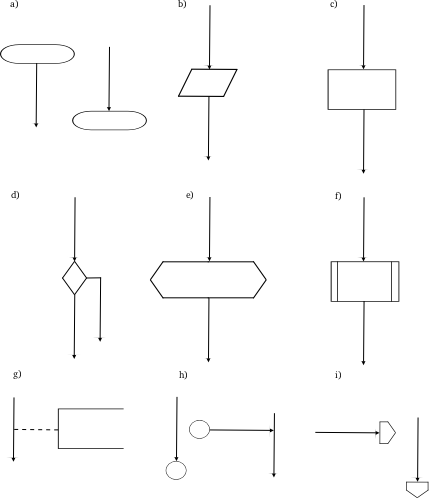
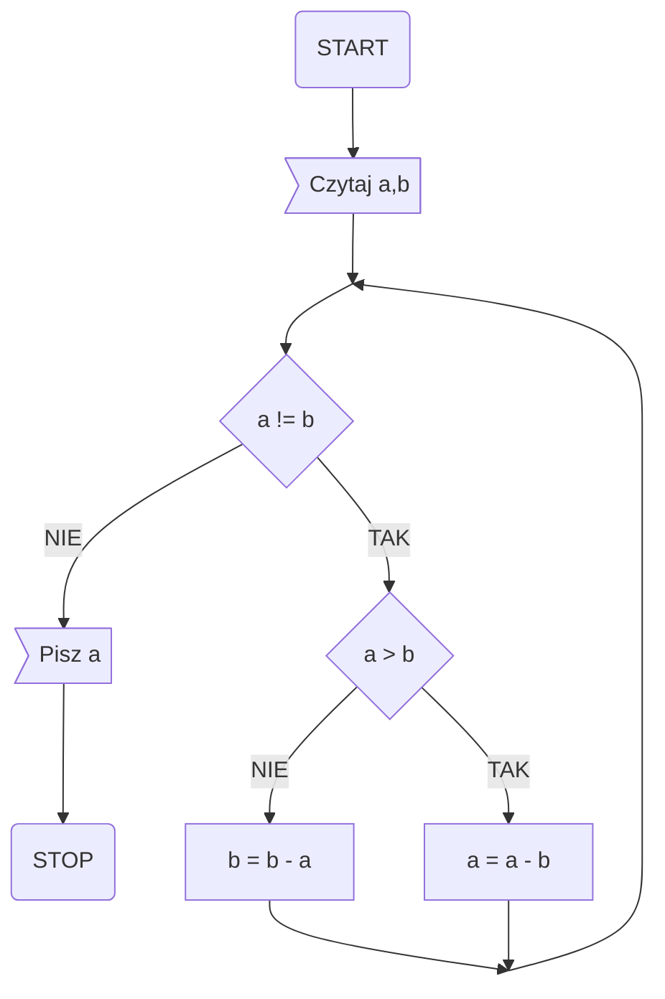

# 1. Algorytmika

## 1.1. Zadania:

1. Stworz algorytm (slowny, pseudokod lub schemat blokowy) robienia kanapki z szynka i pomidorem
2. Stworz algorytm (slowny, pseudokod lub schemat blokowy) sortujacy liczby
3. Stworz algorytm (slowny, pseudokod lub schemat blokowy) filtrujacy liczby na tylko liczby parzyste
4. Uloz schemat blokowy ponizszego pseudokodu
5. Ustal zlozonosc czasową oraz pamieciowa (inaczej, zlozonosc oblczeniowa) ponizszego pseudokodu
6. Uloz pseudokod lub schemat blokowy funkcji ktora liczy pierwiastki funkcji kwadratowej

```python
k = 0
p = 1
n = 100
until n > 1:
  if n mod p == 0: # mod - reszta z dzielenia, np. 5 mod 2 -> 1
    k += 1
     until n mod p == 0 and n > 1:
      n = n div p # div - czesc calkowita z dzielenia, 5 div 2 -> 2
    p += 1
if k mod 2 == 0:
  print TAK
else:
  print NIE
```

## 1.2. Pojecia

### 1.2.1. Algorytm

Algorytm to precyzyjny, uporządkowany zestaw kroków lub reguł, które określają, w jaki sposób rozwiązać określony problem lub wykonać określone zadanie. Algorytmy są używane w informatyce i matematyce do modelowania procesów obliczeniowych.

### 1.2.2. Dane wejsciowe

Dane wejściowe to informacje lub wartości, które są przekazywane do algorytmu w celu przetworzenia. Mogą to być różne typy danych, takie jak liczby, tekst, obrazy lub inne formy danych, zależnie od rodzaju problemu, który algorytm ma rozwiązać.

### 1.2.3. Dane wyjsciowe

Dane wyjściowe to wynik przetwarzania algorytmu na danych wejściowych. Są to informacje lub wartości, które są generowane lub zwracane przez algorytm w odpowiedzi na dane wejściowe. Wyjście może przyjmować różne formy, w zależności od problemu, np. liczby, tekst, obrazy lub inne dane.

### 1.2.4. Schemat blokowy

Schemat blokowy to graficzny sposób reprezentacji algorytmu za pomocą różnych bloków, które reprezentują konkretne operacje, decyzje lub działania. Bloki są połączone strzałkami, które określają kolejność wykonywania operacji. Schematy blokowe są często używane do przedstawiania algorytmów w sposób czytelny i zwięzły.

Wyróżnia się następujące rodzaje bloków:

1. **blok graniczny (a)** – oznacza początek, koniec, przerwanie lub wstrzymanie wykonywania działania, np. blok startu programu
2. **blok wejścia-wyjścia (b)** – przedstawia czynność wprowadzania danych do programu i przyporządkowania ich zmiennym dla późniejszego wykorzystania, jak i wyprowadzenia wyników obliczeń, np. czytaj z, pisz z+10
3. **blok operacyjny (c)** – oznacza wykonanie operacji, w efekcie której zmienią się wartości, postać lub miejsce zapisu danych, np. z: = z + 1
4. **blok decyzyjny (d)**, warunkowy – przedstawia wybór jednego z dwóch wariantów wykonywania programu na podstawie sprawdzenia warunku wpisanego w blok, np. a = b
5. **blok wywołania podprogramu (e)** – oznacza zmianę wykonywanej czynności na skutek wywołania podprogramu, np. MAX(x,y,z)
6. **blok fragmentu (f)** – przedstawia część programu zdefiniowanego odrębnie, np. sortowanie
7. **blok komentarza (g)** – pozwala wprowadzać komentarze wyjaśniające poszczególne części schematu, co ułatwia zrozumienie go czytającemu, np. wprowadzenie danych
8. **łącznik wewnętrzny (h)** – służy do łączenia odrębnych części schematu znajdujących się na tej samej stronie; powiązane ze sobą łączniki oznaczone są tym samym napisem, np. _A1, 7_
9. **łącznik zewnętrzny (i)** – służy do łączenia odrębnych części schematu znajdujących się na różnych stronach; powinien być opisany jak łącznik wewnętrzny i zewnętrzny; poza tym powinien zawierać numer strony, do której się odwołuje, np. _2, 4.3, B5_.



Przyklad schematu blokowego:



### 1.2.5. Pseudokod

Pseudokod to metoda opisu algorytmów za pomocą prostego języka programowania, który jest zbliżony do naturalnego języka. Pseudokod jest używany do przedstawiania koncepcji i logiki algorytmu bez konkretnych składni programistycznych. Jest to elastyczny sposób przedstawiania algorytmów, który może być łatwo przetłumaczony na kod programu w wybranym języku programowania.

### 1.2.6. Zlozonosc czasowa

Złożoność czasowa odnosi się do ilości czasu potrzebnego do wykonania algorytmu w zależności od rozmiaru danych wejściowych. Mierzy się ją zazwyczaj w liczbie operacji wykonanych przez algorytm. Złożoność czasowa jest ważnym czynnikiem przy analizie i porównywaniu algorytmów, ponieważ pomaga ocenić ich wydajność i skalowalność.

### 1.2.7. Zlozonosc pamieciowa

Złożoność pamięciowa odnosi się do ilości pamięci komputerowej, którą algorytm wymaga do wykonania operacji w zależności od rozmiaru danych wejściowych. Mierzy się ją zazwyczaj w liczbie używanych pamięciowych jednostek, takich jak bajty. Złożoność pamięciowa jest również ważnym czynnikiem przy analizie i porównywaniu algorytmów, ponieważ wpływa na efektywne wykorzystanie zasobów pamięciowych systemu.

### 1.2.8. Klasa zlozonosci obliczeniowej

Klasa złożoności obliczeniowej to teoretyczne określenie maksymalnej ilości zasobów obliczeniowych (czasu i pamięci) potrzebnych do rozwiązania danego problemu przy rozmiarze danych wejściowych zbliżonym do nieskończoności. Klasa złożoności obliczeniowej opisuje, jak złożony jest dany problem i jest używana do porównywania algorytmów pod kątem ich efektywności.

Przykłady klas złożoności obliczeniowej to np. O(1) (stała złożoność), O(log n) (logarytmiczna złożoność), O(n) (liniowa złożoność), O(n^2) (kwadratowa złożoność) itd. Klasa złożoności obliczeniowej może być określana zarówno dla złożoności czasowej, jak i pamięciowej. Jest to ważne narzędzie w analizie algorytmów i projektowaniu efektywnych rozwiązań obliczeniowych.

### 1.2.9. Algebra Boole'a

#### Alternatywa (**ang.** `or`, **pol.** `lub`, **znak:** $\lor$)

| A   | B   | A $\lor$ B |
| --- | --- | ---------- |
| 0   | 0   | 0          |
| 0   | 1   | 1          |
| 1   | 0   | 1          |
| 1   | 1   | 1          |

#### Koniunkcja (**ang.** `and`, **pol.** `i` **znak:** $\land$)

| A   | B   | A $\land$ B |
| --- | --- | ----------- |
| 0   | 0   | 0           |
| 0   | 1   | 0           |
| 1   | 0   | 0           |
| 1   | 1   | 1           |

#### Implikacja (**ang.** `if/implies`, **pol.** `jeżeli/implikuje`, znak: $\implies$)

| A   | B   | A $\implies$ B |
| --- | --- | -------------- |
| 0   | 0   | 1              |
| 0   | 1   | 1              |
| 1   | 0   | 0              |
| 1   | 1   | 1              |

#### Równoważność (ang. `equals`, pol. `równe`, znak: $\Leftrightarrow$)

| A   | B   | A $\Leftrightarrow$ B |
| --- | --- | --------------------- |
| 0   | 0   | 1                     |
| 0   | 1   | 0                     |
| 1   | 0   | 0                     |
| 1   | 1   | 1                     |
